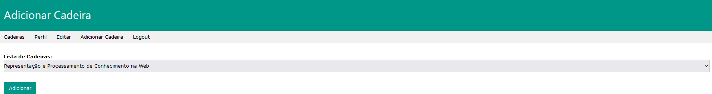

# <a id="frontend">Frontend</a>

Para aceder ao site, é necessário fazer login. Há 3 tipos de contas: `Admin`, `Docente` e `Aluno`.
Se algum dos campos `Email` ou `Password` não existirem ou não corresponderem ao conteúdo na base de dados, a página apresenta um erro `Credenciais Inválidas`.

Existe também a opção de registar uma nova conta onde é obrigatório preencher os campos `Nome Completo`, `E-mail` e `Password`. Depois, o utilizador pode definir se é um aluno ou docente e clica no botão `Confirmar` para efetuar o registo.

Após efetuar o Login, qualquer conta terá acesso a uma página principal com 4 opções: `Cadeiras`, `Perfil`, `Nova Cadeira`, `Logout`. Há também outra opção apenas disponível para contas nível `Admin`: `Exportar Dados`. 

A página de perfil apresenta as informações introduzidas pelo utilizador aquando do registo da sua conta, bem como a lista de Cadeiras em que se encontra associado.

Nesta página também é possível editar as suas informações no botão `Editar`.

Nas contas de admin e docente, no botão do menu `Nova Cadeira`, é possível criar uma nova cadeira que será introduzida na base de dados.

Enquanto que nas contas `Aluno`, neste mesmo botão do menu, apenas é possível associar-se a cadeiras que se encontram já criadas e presentes na base de dados.

Na página de `Exportar Dados`, o admin tem acesso à lista de cadeiras existentes.

Ao clicar numa delas, acede-se a todas as informações acerca da cadeira.

Na aba `Editar Cadeira`, é possível editar estas informações.

Na aba `Alunos`, é listada a lista de alunos registada na cadeira.

Na aba `Upload de Ficheiros`, é possível adicionar ficheiros presentes no computador do utilizador com uma descrição associada que serão associados à cadeira ao clicar no botão `Upload`.

Por fim, como o nome indica, o botão `Logout` irá fazer o logout do utilizador e este será encaminhado novamente para a página de Login.

